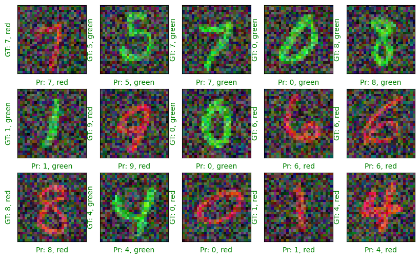
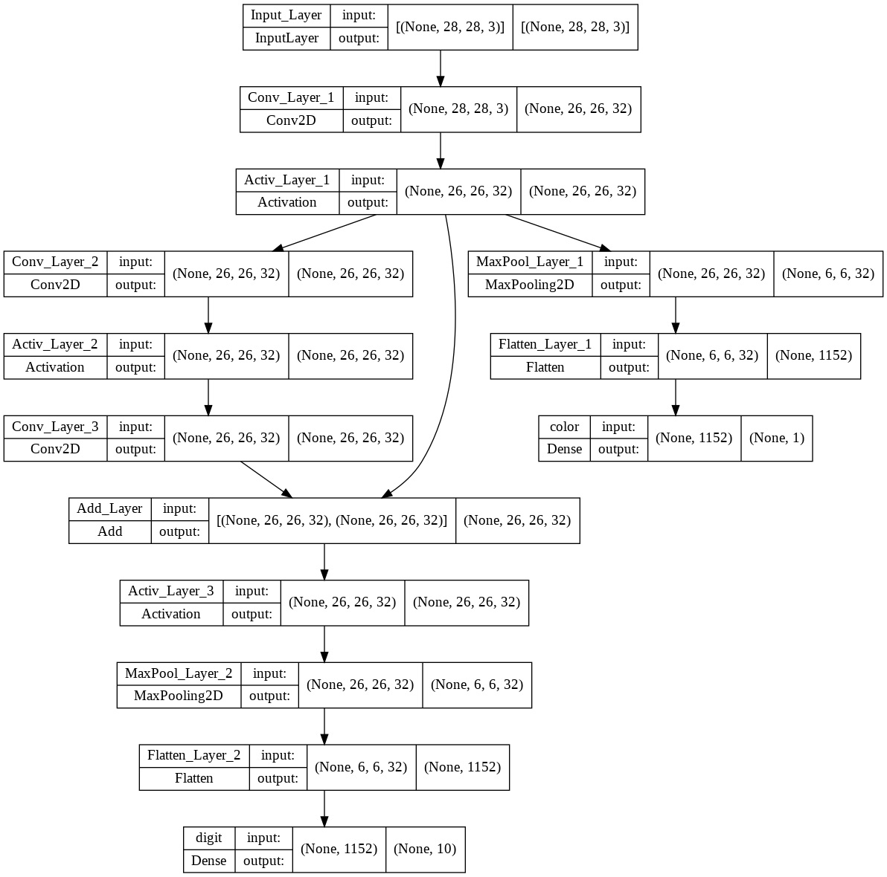

# Coursera - Creating Multi Task Models With Keras

## Project-based Course Overview
### Creating Multi Task Models with Keras
- This is a project-based course which should take less than 2 hours to finish. 
- Before diving into the project, please take a look at the course objectives and structure:

#### Course Objectives
- In this course, our primary learning objective is to create and train a multi task model with Keras.

#### Course Structure
- This course is divided into 3 parts:

#### Course Overview
- This introductory reading material.
- Creating Multi Task Models with Keras: This is the hands on project that we will work on in Rhyme.

#### Project Structure
- The hands on project on Creating Multi Task Models with Keras is divided into following tasks:
    - **Task 1** : Introduction
    - **Task 2** : Create Dataset
    - **Task 3** : Dataset Generator
    - **Task 4** : Create Model
    - **Task 5** : Train the Model
    - **Task 6** : Final Predictions

---

# Output :

### Final Output

### Neural Network 
